# Knowledge Organization

- Selector weight and priority

- Box model

  - Box size calculation

  - verlap calculation for margin

- Float

  - Concept of floating layout

  - Clearing floats

- Position

  - Concept of document flow

  - Position classification

  - Characteristics of fixed position

  - Calculation method for absolute position

- Flex layout

- How to achieve center alignment?

- Understanding semantics

- CSS3 animation

- Repaint and reflow

---

## Selector Weight and Priority

CSS selectors are diverse, with varying weights and priorities. For an element, if there are multiple selectors, the priority needs to be calculated based on weight.

The weight is divided into four levels, respectively:

1. Representing inline styles, such as style="xxx", the weight is 1000;

2. Representing ID selectors, such as #content, the weight is 100;

3. Representing class, pseudo-class and attribute selectors, such as .content, :hover, [attribute], the weight is 10;

4. Representing element selectors and pseudo-element selectors, such as div, p, the weight is 1.

It should be noted that the universal selector (*), child selector (>) and adjacent sibling selector (+) are not in these four levels, so their weight is 0. The selector with a higher weight value also has a higher priority. The selectors with the same weight follow the priority rule of later definitions overriding earlier ones.

### Box Model

What is a “Box”?

Beginners to CSS will certainly learn about padding, border, and margin when they start learning about CSS basics. These three constitute a "box." Just like the packages we receive, even though we only bought a small cell phone, what we receive is a big box. Because there's a buffer layer between the phone's white packaging box and the phone itself (the padding), the white box of the phone has a thickness, even though it's very thin (the border), and between the box and the express box, there's another layer of foam board (the margin). This is a typical box.

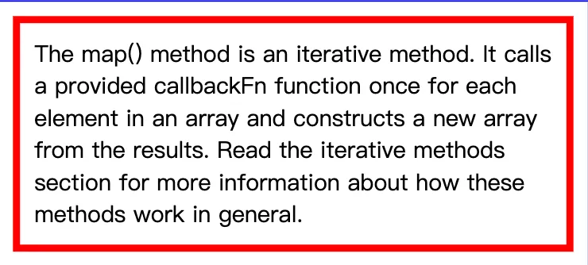

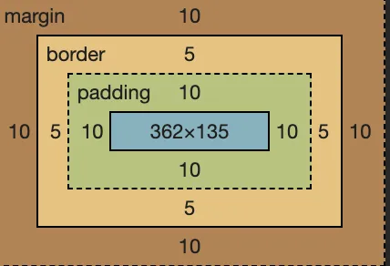

As shown above, the true content is the text, and the text is surrounded by a 10px padding, 5px border, and 10px margin. See the box?

> Topic: How to calculate the width of the box model?

### Fixed Width Box

```
<div style="padding:10px; border:5px solid blue; margin: 10px; width: 300px;">
    The map() method is an iterative method.It calls aprovided callbackFn function once for each element in an array and constructs a new array from the results. Read the iterative methods section for more information about how these methods work in general.
</div>
```

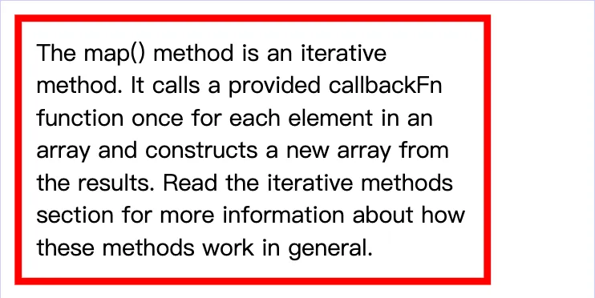

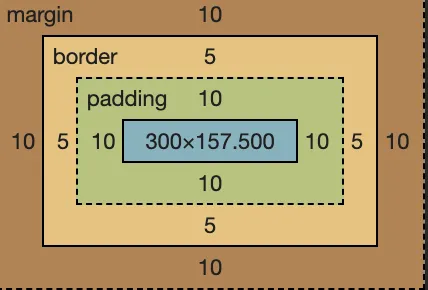

As shown above, after getting the webpage effect, we can use the screenshot tool to measure the width of the text content. It turns out that the width of the text content is exactly 300px, which is the width we set.

Therefore, **in the box model, the width we set is the content width, not the entire box width. The entire box width is the sum of (content width + border width + padding width + margin width)**. Any change to one of the four will result in a change in the box width. This is not friendly for us.

No problem, this unfriendly thing has long been discovered by people and has been solved, we will mention it later.

### Box Filling the Parent Container

By default, div is display:block, and its width will fill the entire parent container. As shown in the figure below:

```
<div style="padding:10px; border:5px solid blue; margin: 10px; width:300px;">
    The map() method is an iterative method.It calls aprovided callbackFn function once for each element in an array and constructs a new array from the results. Read the iterative methods section for more information about how these methods work in general.
    The map() method is an iterative method.It calls aprovided callbackFn function once for each element in an array and constructs a new array from the results. Read the iterative methods section for more information about how these methods work in general.
</div>
```

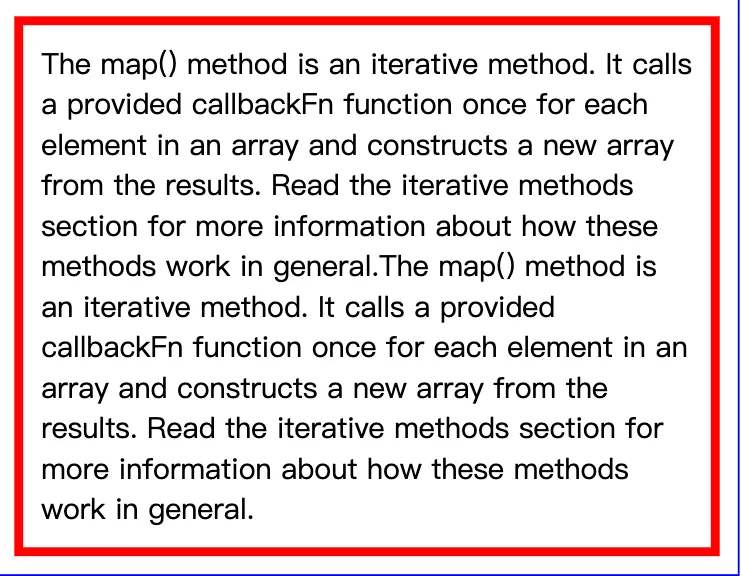

Don’t forget, this div is a box model, and the entire width of it includes (**content width + border width + padding width + margin width**), and the entire width fills the parent container.

The problem lies here. If the parent container width does not change, increasing the width value of one of the margin, border, or padding will result in a decrease in the content width. In extreme cases, if the content width is compressed so that it cannot be compressed anymore (for example, the width of one character), then the browser will force the parent container width to increase. This is not what we want to see.

### Content Wrapped Box

In this case, it’s quite simple, the content width is calculated according to the content, and the box width will add ( **padding width + border width + margin width**) on the basis of the content width.

```
<div style="padding:10px; border:5px solid blue; margin: 10px; width:300px;">
    The map() method is an iterative method.It calls aprovided callbackFn function once for each element in an array and constructs a new array from the results. Read the iterative methods section for more information about how these methods work in general.
</div>
```

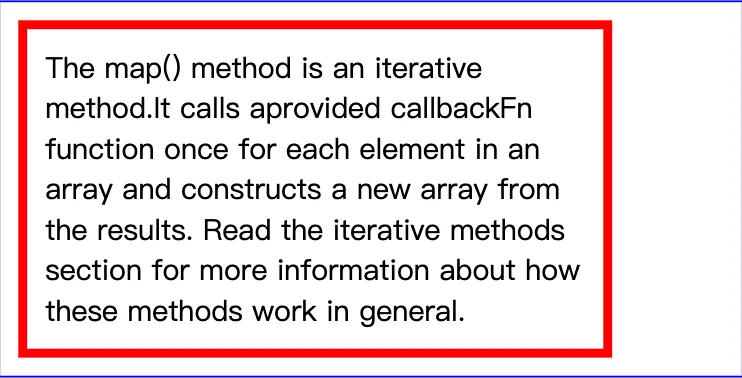

```
box-sizing: border-box
```

As mentioned earlier, when setting the width for the box model, the result is only the width of the content, which is unreasonable. How to solve this problem? The answer is to specify the style for the box: ** box-sizing: border-box **.

```
<div style="padding:10px; border:5px solid blue; margin: 10px; width:300px; box-sizing:border-box;">
    The map() method is an iterative method.It calls aprovided callbackFn function once for each element in an array and constructs a new array from the results. Read the iterative methods section for more information about how these methods work in general.
</div>
```

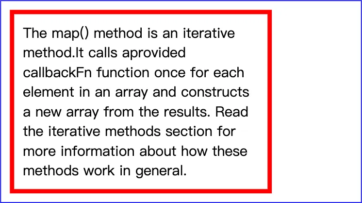

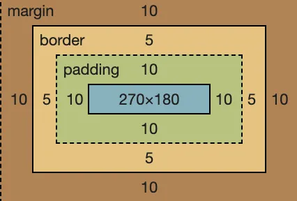

As shown in the figure above, after the div is set with box-sizing:border-box, the width of 300px is the width of the **content + padding + border** (excluding margin). In this way, it is more in line with our actual requirements. I suggest that when writing CSS for the system, the first style is:

```
* {
    box-sizing:border-box;
}
```

The well-known Bootstrap also adds box-sizing:border-box to its * selector. Why shouldn't we do it?

### Vertical Margin Overlap

Speaking of margin, I have to mention a characteristic of margin — vertical overlap. If the vertical margin of `<p>` is 16px, then what is the vertical distance between the two `<p>`? —— In theory, it should be 16 + 16 = 32px, but the answer is still 16px. Because the vertical margins overlap, if the two are not the same size, the larger one will "devour" the smaller one.

## float

float is used more for webpage layout and is relatively simple to use. Here, some important points that need to be noted are summarized for your reference.

### Misunderstanding and Misuse

The original intention of the float design is for text wrapping effect, that is, an image and a paragraph of text, after the image float:left, the text will wrap around the image.

```
<div>
    
    A paragraph of text, a paragraph of text, a paragraph of text, a paragraph of text, a paragraph of text, a paragraph of text, a paragraph of text, a paragraph of text, a paragraph of text.
</div>
```

However, people later discovered that the webpage layout previously implemented by table can be achieved by combining float + div, so it was "misused" for webpage layout.

Question: Why does float cause the parent element to collapse?

### Destructiveness

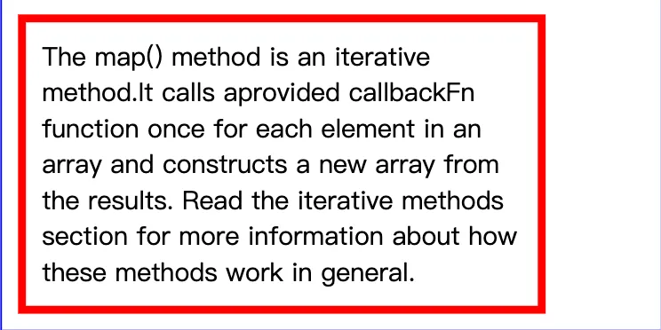

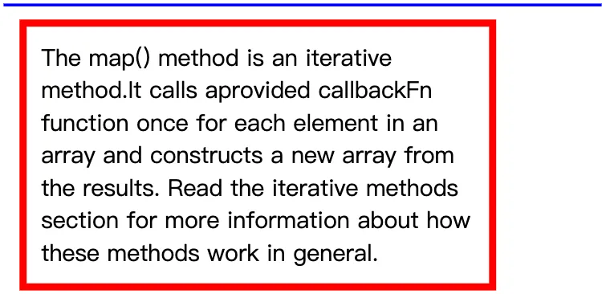

The destructiveness of float — float destroys the original structure of the parent tag, resulting in the collapse of the parent tag. The fundamental reason for this phenomenon is that the elements set with float will deviate from the document flow. The real reason lies in the original intention of the float design to solve the problem of text wrapping around images. Remember this impact of float.

### Wrapping

Wrappping is another very important feature of float. You must be familiar with this feature when using float. Let’s start with a small example:

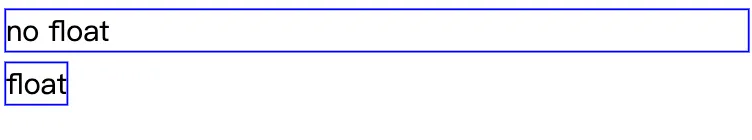

As shown above, the normal div if no width is set, it will fill up the whole screen, which was also mentioned in the previous box model section. But if you add float:left to the div, it suddenly becomes compact, the width changes, and it wraps the three words in the content - this is the wrapping. After the div is set to float, its width will automatically be adjusted to wrap the content width, not to span the entire parent container.

Note that at this point the div does reflect the wrapping, but its display style has not changed and is still display: block.

Why should the float have the wrapping? Actually, the answer still has to be found from the original intention of float design, float is designed to realize the text wrap effect. Text wrapping around images is easy to understand, but what if you want the text to wrap around a div? If the div is not “wrapped” at this time, the wrap effect cannot be achieved.

### Clear Space

Float also has a feature that may not be very familiar to everyone — clearing space. As usual, let’s start with an example.

```
<div style="border: 2px solid blue; padding:3px;">
    
    
    
    
</div>
```

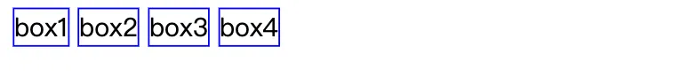

After adding float:left:

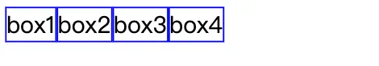

In the first picture above, there will normally be spaces in the middle of the img, because multiple img tags will have line breaks, and the browser recognizes line breaks as spaces, which is very normal. In the second picture, the img style is added with float:left, which makes there no spaces between the imgs, and the four imgs are close together.

If you haven’t paid attention to this feature before, now think about the programs you wrote before, there should be this feature. Why is float suitable for webpage layout (commonly known as “bricklaying”)? It’s because the webpage layout with float is seamless, even a fly can’t fly in.

The fundamental reason for the “clearing space” feature is that float will cause the node to deviate from the document flow structure. It is no longer part of the document flow structure, so its surrounding line breaks, spaces are all unrelated to it, and it tries to lean to one side as much as possible, this is the essence of clearing space.

> Topic: Write down clearfix by hand

### clearfix

The style commonly used to clear the float effect is as follows, collectively referred to as clearfix code. All float element's parent containers, in general, should add the 'clearfix' class.

```
.clearfix:after {
    content: '';
    display: table;
    clear: both;
}
.clearfix {
    *zoom: 1; /* Compatible with older IE versions */
}
<div class="clearfix">
    
    
</div>
```

### Conclusion

The original intention of the float design is to solve the problem of text wrapping around pictures. Later, it was used for layout by mistake, so there are many unsuitable or attention points, which are basically mentioned in the article. If you are just starting to learn about floats, after learning the basic knowledge above, you should also do some exercises to practice — the classic “Holy Grail Layout” and “Double Wing Layout”. This will not be expanded here, there are plenty of resources online, such as [Discussing Two Classic Layouts Often Tested in Interviews — Grail and Double Wing](https://juejin.im/entry/5a8868cdf265da4e7e10c133?utm_source=gold_browser_extension) (the last two pictures in this article clearly show these two layouts).

## position

position is used for the positioning of webpage elements, and can set `static/relative/absolute/fixed` these values, among which static is the default value and does not need to be introduced.

> Topic: What is the difference between relative and absolute?

### relative

The relative positioning can be easily demonstrated with an example. For example, we write 4 `<p>`, and the result can be known without looking.

```
<p>The first paragraph.</p>
<p>The second paragraph.</p>
<p>The third paragraph.</p>
<p>The fourth paragraph.</p>
```

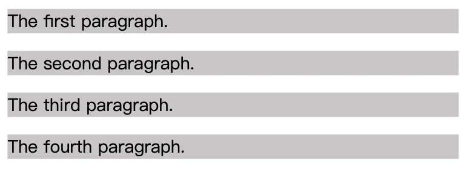

Then we add position:relative to the third `<p>` and set the values of left and top, and see what changes this `<p>` will have.

```
<p>The first paragraph.</p>
<p>The second paragraph.</p>
<p style="position:relative; top: 10px; left: 10px">The third paragraph.</p>
<p>The fourth paragraph.</p>
```

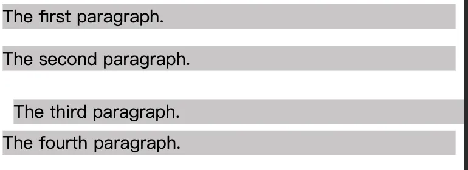

In the picture above, there should be two pieces of information you should identify (I believe most people will ignore the second piece of information):

- The third `<p>` has a position change, moving 10px to the right and 10px down;

- The positions of the other three `<p>`s have not changed, which is also very important.

It can be seen that **relative will cause relative changes in its own position and will not affect the position and size of other elements**. This is one of the key points of relative. The second key point is that relative creates a new positioning context. The detailed introduction of the positioning context is given below.

### absolute

Still, write a basic demo first.

```
<p>The first paragraph.</p>
<p>The second paragraph.</p>
<p style="background: yellow">The third paragraph.</p>
<p>The fourth paragraph.</p>
```

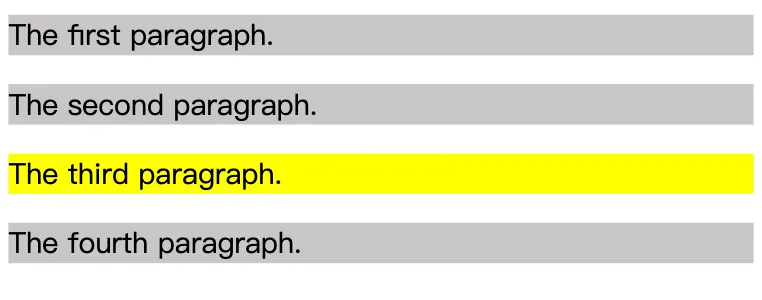

Then, we change the third `<p>` to position:absolute; and see what changes will happen.

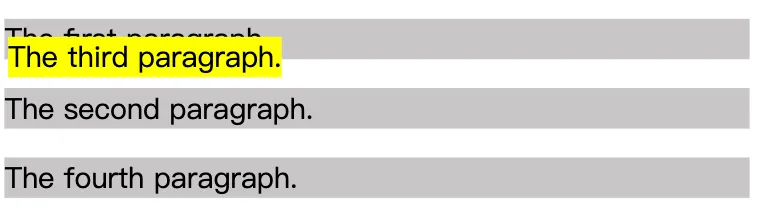

From the above results, we can derive several pieces of information:

1. The absolute element has departed from the document structure. Unlike relative, the positions of the other three elements have been rearranged. As long as the element departs from the document structure, it will be destructive, causing the parent element to collapse. (At this point, you should immediately think of float elements also depart from the document structure.)

2. The absolute element has “wrap-around” characteristics. The width of the previous `<p>` filled the entire screen, but now the width of the `<p>` is just the width of its content.

3. The absolute element has “follow” characteristics. Although the absolute element has departed from the document structure, its position has not changed and remains dutifully in its original location because we have not set the top, left values at this time.

4. The absolute element will float on the page, covering the content below the page.

Lastly, by setting the top, left values for absolute elements, you can customize its content, which is quite common. It should be noted that when the top, left values are set, the element is positioned relative to the nearest positioned context, not relative to the browser.

### Fixed

In fact, fixed and absolute are the same, the only difference being that absolute elements are positioned according to the nearest positioning context, while fixed is positioned according to the window (or iframe).

> Topic: Who do relative, absolute, and fixed depend on for positioning?

### Positioning Context

The positioning of a relative element is always relative to its own position, unrelated to other elements and does not affect other elements.

The positioning of a fixed element is relative to the window (or iframe) boundary and is not related to other elements. But it is destructive and will cause changes in the positions of other elements.

The positioning of absolute is much more complex compared to the previous two. If top and left are set for absolute, what does the browser use to determine its vertical and horizontal offsets? The answer is that the browser will recursively search all parent elements of this element. If it finds an element set with position: relative/absolute/fixed, it will position relative to this element. If not found, it will position relative to the browser boundary.

## Flexbox layout

The traditional solution to layouts is based on the box model, reliant on **the display property + the position property + the float property**. This proves to be inconvenient for special layouts, such as vertical centering. In most modern mobile pages, the requirements can be better fulfilled by using flex layout, making knowledge of flex layout mandatory.

### Basic application

Flex layout can be used in any container, with the code being very simple.

```
<style type="text/css">
    .container {
      display: flex;
    }
    .item {
        border: 1px solid #000;
        flex: 1;
    }
</style>
<div class="container">
    <div class="item">aaa</div>
    <div class="item" style="flex: 2">bbb</div>
    <div class="item">ccc</div>
    <div class="item">ddd</div>
</div>
```

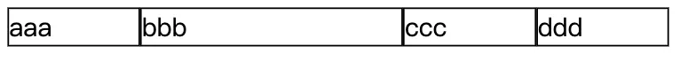

Note the flex: 2 in the third `<div>`, with other `<div>` having flex: 1. Consequently, the width of the second `<div>` is twice as much as the others.

### Design principles

The elements with display: flex are called “containers” (flex container), while all its child nodes are called “items” (flex item). By default, the container has two axes: the horizontal main axis (main axis) and the vertical cross-axis (cross axis). The intersection point of the main axis with the start position (border) is referred as main start, and the end position as main end; the start position of the cross axis is cross start, while the end is cross end. The items are arranged on the main axis by default. The space that the single item occupies on the main axis is called the main size, while the one on the cross axis is the cross size.

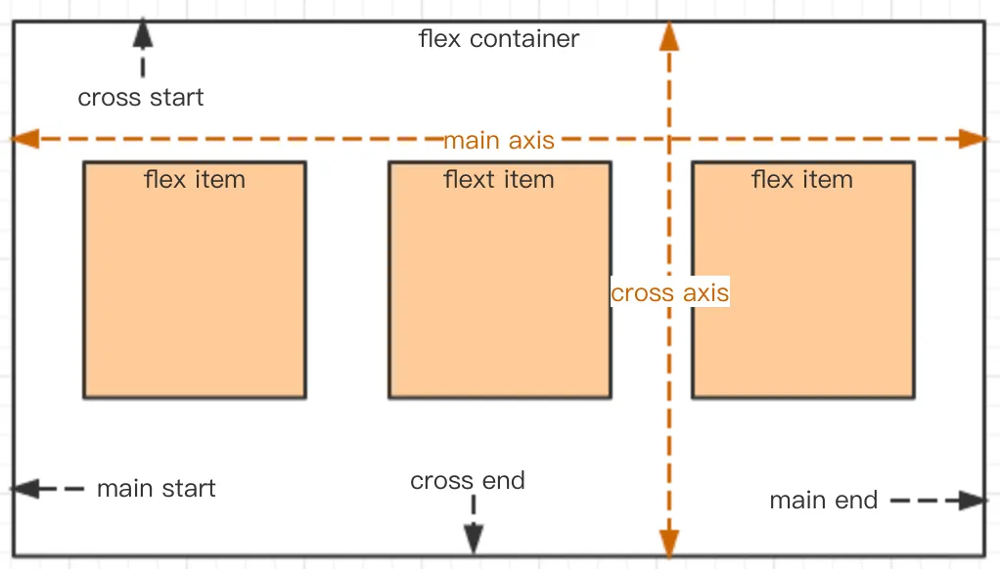

Combine the text above with the resulting images and read it again in detail. It should give a better understanding of flex layout’s principles, leading to a more intuitive experience.

### Setting direction of the main axis

flex-direction can style the main axis's direction, with four optional values:

- **row** (default): the main axis is horizontal, with the starting point on the left.

- **row-reverse**: the main axis is horizontal, with the starting point on the right.

- **column**: the main axis is vertical, with the starting point on the top.

- **column-reverse**: the main axis is vertical, with the starting point at the bottom.

```
.box {
  flex-direction: column-reverse| column | row | row-reverse;
}
```

The code above sets the direction of the main axis according to the diagrams below.

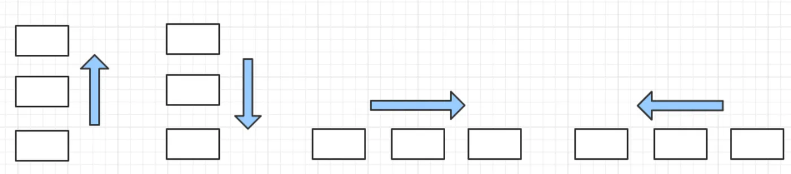

### Setting alignment of the main axis

justify-content properties define the alignment of the items on the main axis, with the following values:

- **flex-start** (default): aligns towards the starting point of the main axis.

- **flex-end**: aligns towards the end of the main axis.

- **center**: alignment is centered.

- **space-between**: alignment spans both ends, with equal spacing amidst the items.

- **space-around**: the spacing around each item is equal. This means that the spacing between items has a value twice as much as the spacing between items and the borders.

```
.box {
    justify-content: flex-start | flex-end | center | space-between | space-around;
}
```

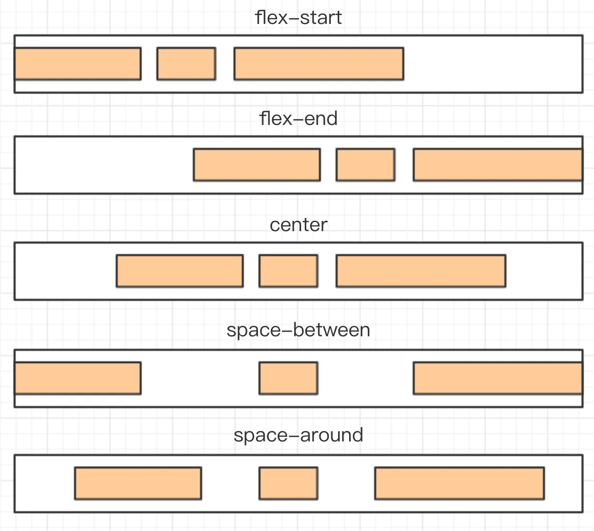

### Alignment on the cross axis

align-items properties define how items are aligned on the cross axis, with the following values:

- **flex-start**: aligns with the start of the cross axis.

- **flex-end**: aligns with the end of the cross axis.

- **center**: aligns with the point at the center of the cross axis.

- **baseline**: aligns with the baseline of the first line of text of the item.

- **stretch** (default): if the item doesn't have a set height or is set to auto, it will occupy the whole height of the container.

```
.box {
    align-items: flex-start | flex-end | center | baseline | stretch;
}
```

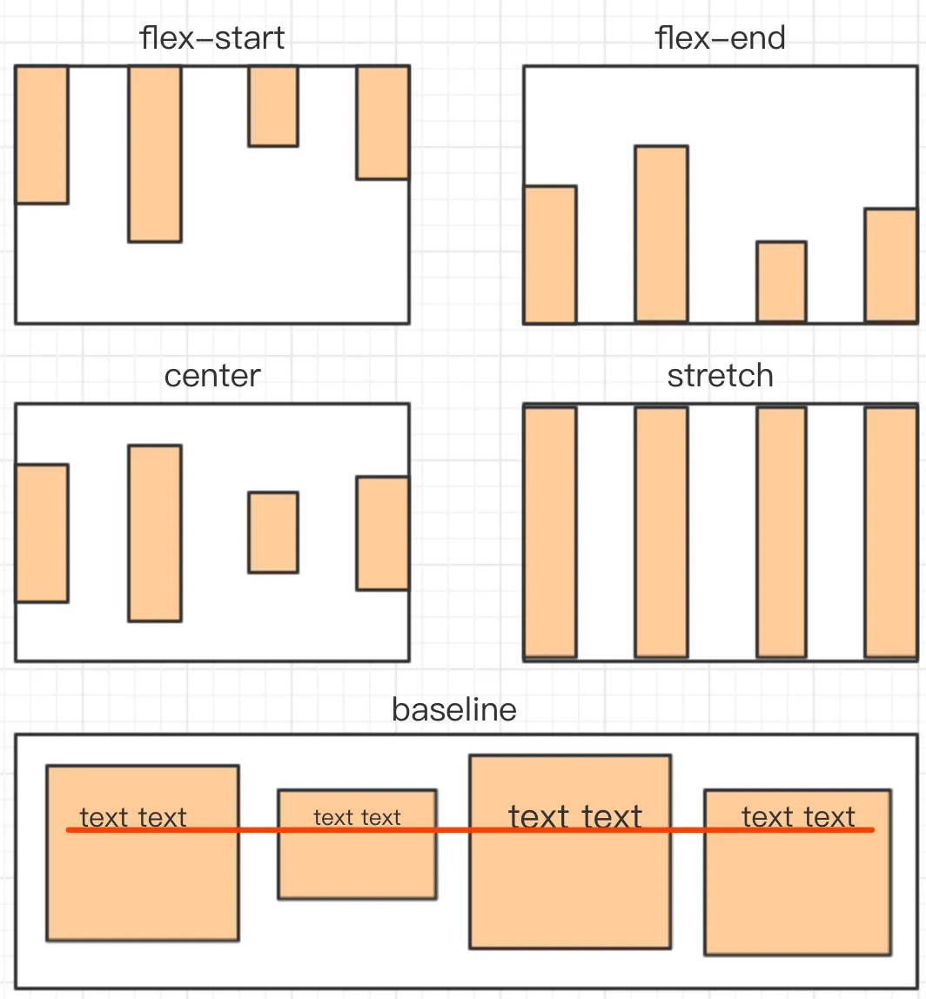

## How to achieve center alignment?

> Topic: How do you achieve horizontal center alignment?

### Horizontal centering

To center the inline elements, all you need to do is apply text-align: center;, like so:

```
.container {
   text-align: center;
}
```

For block elements, use margin: auto;. Many websites from the PC era used this arrangement.

```
.container {
    text-align: center;
}
.item {
    width: 1000px;
    margin: auto;
}
```

To center absolutely positioned elements, combine left and margin. However, this works only when the width is known.

```
.container {
    position: relative;
    width: 500px;
}
.item {
    width: 300px;
    height: 100px;
    position: absolute;
    left: 50%;
    margin: -150px;
}
```

> Topic: How do you achieve vertical centering?

### Vertical centering

For inline elements, set the value of line-height to equal the value of height, such as vertically centering a single line of text:

```
.container {
   height: 50px;
   line-height: 50px;
}
```

For absolutely positioned elements, combine left and margin. However, one must be acquainted with the dimensions beforehand.

- Advantage: Good compatibility

- Disadvantage: Must know dimensions beforehand

```
.container {
    position: relative;
    height: 200px;
}
.item {
    width: 80px;
    height: 40px;
    position: absolute;
    left: 50%;
    top: 50%;
    margin-top: -20px;
    margin-left: -40px;
}
```

For absolutely positioned elements, another solution is to combine transform for centering.

- Advantage: No need to know dimensions beforehand

- Disadvantage: Poor compatibility

```
.container {
    position: relative;
    height: 200px;
}
.item {
    width: 80px;
    height: 40px;
    position: absolute;
    left: 50%;
    top: 50%;
    transform: translate(-50%, -50%);
    background: blue;
}
```

The absolute position can be combined with margin: auto in such a way that one doesn't need to be aware of the dimensions beforehand. Plus, compatibility is good.

```
.container {
    position: relative;
    height: 300px;
}
.item {
    width: 100px;
    height: 50px;
    position: absolute;
    left: 0;
    top: 0;
    right: 0;
    bottom: 0;
    margin: auto;
}
```

There are other solutions to this issue, but there’s no need to master them all — being able to articulate the solutions mentioned above is good enough.


## Understanding semantics

> Topic: How to understand HTML semantics?

Semantic means “making it easier to understand”. People need to be able to read (write and interpret) the program more easily. Machines (browsers and search engines) should also read it just as easily.

### Making it easier for people to understand

For people, code readability, semantic is a very broad concept. For instance, defining easily understood names when declaring JS variables or defining CSS class — such as length list, instead of incomprehensible names like a b.

However, the “semantics” that we usually examine do not test such broad-based issues. They test HTML semantics, specifically to better enable machines to read HTML.

### Making it easier for machines to understand

HTML complies with the XML standard but differs from XML — HTML does not allow custom tags like XML; HTML has its predefined tags. The question is — why does HTML define so many tags like p div h1 ul and others - for semantics. If you are proficient in CSS, you can use the `<div>` tag to achieve all web page effects, without using other tags like p h1 ul and others. But we do not recommend this because it negates the purpose of HTML semantics.

Speaking of search engines, when crawlers download the HTML code of our web page, how can they better understand the contents of the page? — This is done according to the predefined tags in HTML. The h1 tag represents the title; the content inside p is the detailed paragraph, which does not necessarily have the same weight as the title; ul contains lists; strong stands for bold and emphasized content... If we do not write according to HTML semantics and use the `<div>` tag for everything, search engines will have difficulty understanding our web page's content.

To enhance the semantics of HTML, the HTML5 standard has added tags such as header, section, and article. Therefore, semantics is significant when writing HTML, otherwise, W3C would not have gone to the trouble of developing these standards.

## CSS3 Animation

CSS3 can create animations, replacing the original Flash and JavaScript solutions.

First, a @keyframes is used to define an animation named testAnimation. The code below uses percentages to set different CSS styles specifying the animation's changes. All animations can be defined in this manner.

```
@keyframes testAnimation
{
    0%   {background: red; left:0; top:0;}
    25%  {background: yellow; left:200px; top:0;}
    50%  {background: blue; left:200px; top:200px;}
    75%  {background: green; left:0; top:200px;}
    100% {background: red; left:0; top:0;}
}
```

Next, an animation is set for a CSS selector. Here, an animation is set for the div element as follows:

```
div {
    width: 100px;
    height: 50px;
    position: absolute;
    animation-name: myfirst;
    animation-duration: 5s;
}
```

animation-name corresponds to the animation's name while animation-duration refers to the duration of the animation. There are other properties:

- animation-timing-function: Specifies the animation's speed curve. Default is ease

- animation-delay: Indicates when the animation will start. Default is 0

- animation-iteration-count: Dictates how many times the animation will be played. Default is 1

- animation-direction: Dictates whether the animation will be played in reverse in the next cycle. Default is normal

- animation-play-state: Specifies whether the animation is running or paused. Default is running

- animation-fill-mode: Specifies how the target of the animation is applied before and after the execution of the 

- animation, default is none, to retain at the last frame you can use forwards

> Topic: What’s the difference between CSS’s transition and animation?

Both transition and animation can create dynamic effects. Semantically, transition is a transition from one state to another, like transitioning from a height of 100px to 200px; whereas animation is an animation that is more professional for creating dynamic effects. animation has the concept of frames and can have ‘keyframes’. One animation can consist of multiple key frames by going through multiple states. In addition, animation also includes multiple properties mentioned above.

### Repainting and Reflow

Repainting and reflow are often examined in interviews and are points to note when optimizing performance. The author provides a brief introduction below.

- Repainting: Refers to when elements on the page do not leave the Document Flow but only change styles, such as by changing the colour or background. The browser redraws the style.

- Reflow: Refers to when the dimensions, location, or some attributes of a DOM element in the Document Flow change, causing the browser to re-render part or the entire document.

Compared to repainting, reflow consumes more performance resources. Moreover, certain property reads could also cause reflow — for example, reading the height and width of a certain DOM, or using the getComputedStyle method. To avoid repainting and reflow while coding, you could try the following:

> Topic: Find potential improvements in the following code and optimize it

```
var data = ['string1', 'string2', 'string3'];
for(var i = 0; i < data.length; i++){
    var dom = document.getElementById('list');
    dom.innerHTML += '<li>' + data[i] + '</li>';
}
```

The loop in the code above retrieves dom with each iteration and accumulates li in its HTML. Each iteration manipulates the DOM structure. You could use documentFragment or precompile the HTML string before using innerHTML just once.
