In front end development, front end engineering is always accompanied by the whole development process. In our commonly used project packaging tools, whether it’s webpack or rollup, they all have a very powerful capability — tree-shaking. So, what is the principle of tree-shaking? The core principle is actually AST.

In fact, there are many applications of AST in front end development, such as webpack, a packing tool we frequently use in front-end projects, Eslint, a code inspection tool, and Babel, a code conversion tool all rely on the syntax analysis and conversion capabilities of AST.

## AST Simple Introduction

AST is the abbreviation of Abstract Syntax Tree, which can be used to describe the syntax structure of our code.

Here’s an example:

```
// ast.js
let a = 1;
function add() {}
```

I created a file `ast.js` here, which can be understood as a File node to store the program body, and inside it are our JavaScript syntax nodes. The root node of our JavaScript syntax nodes is Program, and we have defined two nodes in it. The first node is `let a = 1`, which is parsed as AST is VariableDeclaration, that is a variable declaration node. The second node is `function add() {}`, which is parsed as AST is FunctionDeclaration, that is, a function declaration node.

Here I recommend a platform: AST Explorer, where you can clearly see the result of JavaScript code translated into AST. If you look at the picture below, you’ll understand it at a glance:

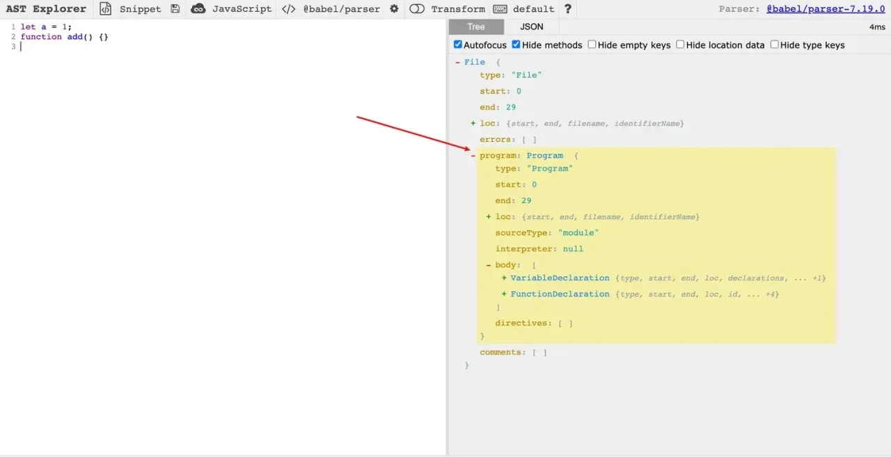

## Role of AST

What can we do with the ast information of the code?

1. Code analysis and conversion. AST can parse our code into an ast tree, naturally we can process and convert this tree, the most classic application of which has to be babel, which converts our high-level syntax ES6 into ES5, and then transforms the ast tree into code output. In addition, the processing of ES6’s import and export by webpack also depends on the capabilities of ast, as well as the syntax conversion of our jsx, etc.

2. Syntax checking and error hinting. After parsing the syntax into an ast tree, we can naturally check its syntax for correctness according to certain syntactic rules, and if there is an error, we can throw it out and remind the developer to correct it. For example, vscode that we use is using AST to provide real-time syntax checking and error hinting. In front-end projects, the most widely used syntax checking tool is ESLint, which is basically essential for front-end projects.

3. Static type checking. This is a bit like the second point, but the second point is focused on syntax checking, while this is for type checking, for example, our Typescript will use ast for type checking and inference.

4. Code refactoring. Based on the AST tree, we can automatically refactor the code, such as extracting functions, renaming variables, upgrading syntax, moving functions, etc.

In fact, in practical development, we can use it to do a lot of things, such as automatic burying, automatic internationalization, dependency analysis and governance, etc. Interested partners can explore on their own.

And today I am mainly introducing a major application of AST, which is the powerful Tree-Shaking capability of our webpack.

## Tree-shaking

The translation of Tree-shaking is shaking the tree. This tree can be metaphorically a tree in reality, and can be understood as such, shaking the tree is to shake off the leaves that are yellowing, serving no function and still absorbing nutrients. To move this into the JavaScript program is to remove the unused code (dead-code) in the JavaScript context.

Without further ado, let’s look at the example:

```
// test.js
function add(a, b) {
    return a + b;
}
function multiple(a, b) {
    return a * b;
}
let firstNum = 3, secondNum = 4;
add(firstNum, secondNum);
```

In this code, we define two functions, add and multiple, two variables firstNum and secondNum, and then call the add method and pass firstNum and secondNum as parameters.

Clearly, the multiple method is not called, and can actually be deleted during packaging to reduce the size of our packaged code.

So, how to delete multiple? It’s time for our ast to come on stage! To achieve this function, there are three steps.

### Step 1: Parse source code to generate AST

Look at this example:

```
const acorn = require('acorn');
const fs = require('fs');
const path = require('path');
const buffer = fs.readFileSync(path.resolve(process.cwd(), 'test.js')).toString();
const body = acorn.parse(buffer, {
    ecmaVersion: 'latest',
}).body;
```

We choose acorn to parse our code (babel is actually based on acorn for implementing parsers). Before executing, we need to install acorn by running npm install acorn, then read the file content and pass it into acorn to get AST.

We can use AST Explorer to view our current AST.

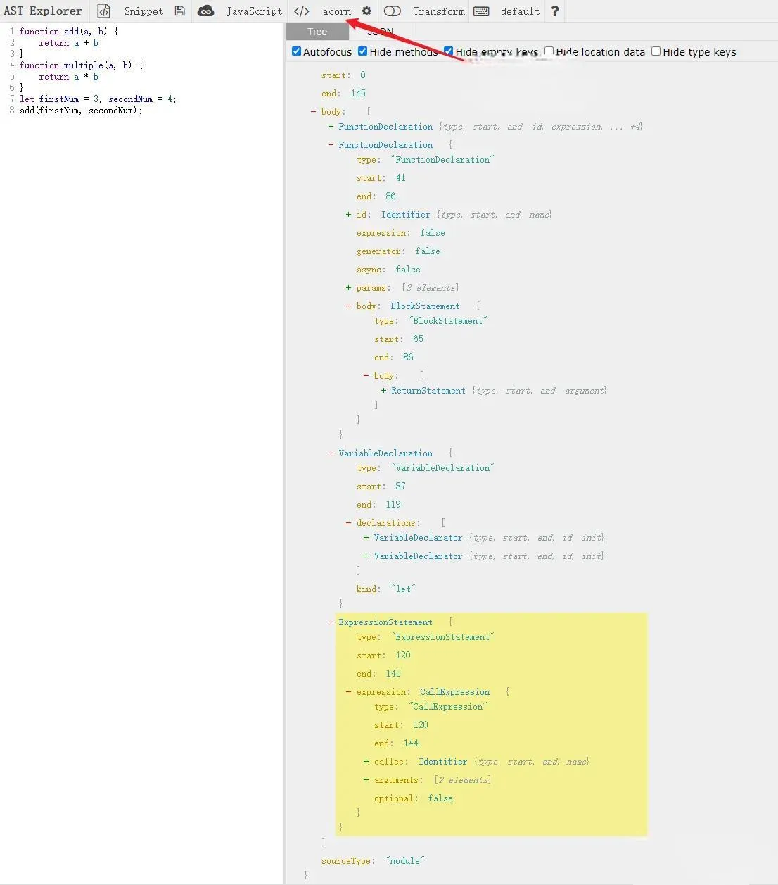

### Step 2: Traverse AST, record relevant information

What information do we need to record?

Our main goal is to collect unused code and then delete it. Thus the two pieces of information we would primarily think to collect are:

1. Collect all function nodes or variable type nodes

2. Collect all used function nodes or variable type nodes

Let’s try:

```
const acorn = require('acorn');
const fs = require('fs');
const path = require('path');
const buffer = fs.readFileSync(path.resolve(process.cwd(), './src/index.js')).toString();
const body = acorn.parse(buffer, {
    ecmaVersion: 'latest',
}).body;
// Reference a Generator class to generate corresponding code for AST
const Generator = require('./generator');
// Create a Generator instance
const gen = new Generator();
// Define a variable "decls" to store all function or variable type nodes (Map type)
const decls = new Map();
// Define a variable "calledDecls" to store used function or variable type nodes (Array type)
const calledDecls = [];
```

I’ve introduced a Generator here whose function is to transform each AST node into the corresponding code. Let’s look at the implementation of Generator:

1. First, define the Generator class and export it.

```
// generator.js
class Generator {
}

module.exports = Generator;
```

2. Then, define the run method and the visitNode and visitNodes methods.

- run: calls the visitNodes method to generate code.

- visitNode: based on the node type, calls the corresponding method for the corresponding processing.

- visitNodes: handles array type nodes. Internally, it loops and calls the visitNode method.

```
// generator.js
class Generator {
     run(body) {
        let str = '';
        str += this.visitNodes(body);
        return str;
    }
    visitNodes(nodes) {
        let str = '';
        for (const node of nodes) {
            str += this.visitNode(node);
        }
        return str;
    }
    visitNode(node) {
        let str = '';
        switch (node.type) {
            case 'VariableDeclaration':
                str += this.visitVariableDeclaration(node);
                break;
            case 'VariableDeclarator':
                str += this.visitVariableDeclarator(node);
                break;
            case 'Literal':
                str += this.visitLiteral(node);
                break;
            case 'Identifier':
                str += this.visitIdentifier(node);
                break;
            case 'BinaryExpression':
                str += this.visitBinaryExpression(node);
                break;
            case 'FunctionDeclaration':
                str += this.visitFunctionDeclaration(node);
                break;
            case 'BlockStatement':
                str += this.visitBlockStatement(node);
                break;
            case 'CallExpression':
                str += this.visitCallExpression(node);
                break;
            case 'ReturnStatement':
                str += this.visitReturnStatement(node);
                break;
            case 'ExpressionStatement':
                str += this.visitExpressionStatement(node);
                break;
        }
        return str;
    }
}
```

Next, we’ll discuss how each method that processes a node type is implemented:

**Implement the visitVariableDeclaration method**

```
class Generator {
     ...
    visitVariableDeclaration(node) {
        let str = '';
        str += node.kind + ' ';
        str += this.visitNodes(node.declarations);
        return str + '\n';
    }
     ...
}
```

`visitVariableDeclaration` processes nodes such as `let firstNum = 3` in variable declarations. `node.kind` represents `let/const/var`. Then, multiple variables can be declared at once, such as `let firstNum = 3, secondNum = 4`; in our `test.js`, which gives us two nodes in `node.declarations`.

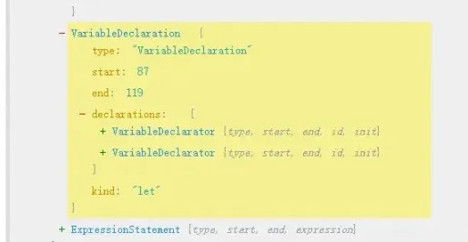

**Implement the visitVariableDeclarator method**

```
class Generator {
    ...
    visitVariableDeclarator(node, kind) {
        let str = kind ? (kind + ' ') : '';
        str += this.visitNode(node.id);
        str += '=';
        str += this.visitNode(node.init);
        return str + ';' + '\n';
    }
    ...
}
```

`visitVariableDeclarator` is a child node of the above `VariableDeclaration`, which can receive the `kind` of the parent node. For example, `let firstNum = 3`, here id is the variable name firstNum, and init is the initial value 3.

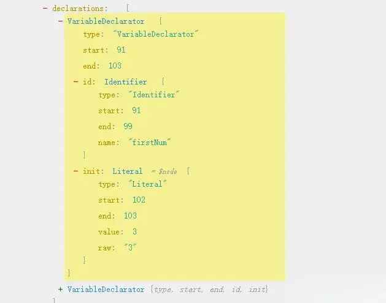

**Implement the visitLiteral method**

```
class Generator {
     visitLiteral(node) {
        return node.raw;
    }
}
```

In Literal we have literals, like the 3 in `let firstNum = 3`, which is a string literal. In addition to this, there are numeric literals, boolean literals, etc., we just need to return its raw attribute.

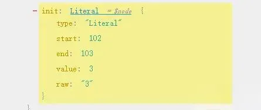

**Implement the visitIdentifier method**

```
class Generator {
     visitIdentifier(node) {
        return node.name;
    }
}
```

`Identifier` refers to identifiers, such as variable names, attribute names, parameter names, etc. For example, for `let firstNum = 3`, the firstNum. We just need to return its name attribute directly.

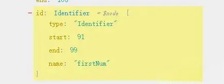

**Implement the visitBinaryExpression method**

BinaryExpression refers to binary expressions, like addition, subtraction, multiplication, and division operations in our case. For instance, the AST for "a + b" is like this:

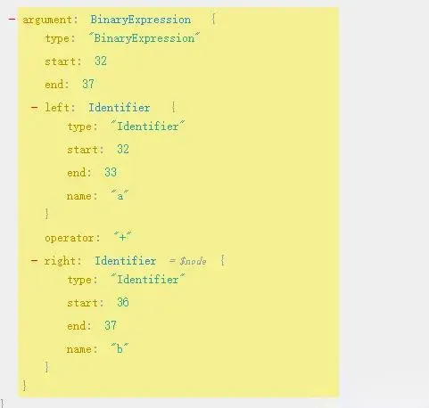

We need to join its left and right nodes and the middle identifier.

```
class Generator {
     visitBinaryExpression(node) {
        let str = '';
        str += this.visitNode(node.left);
        str += node.operator;
        str += this.visitNode(node.right);
        return str + '\n';
    }
}
```

**Implement the visitFunctionDeclaration method**

FunctionDeclaration refers to function declaration nodes. It's a bit more complex as we need to join a function together.

```
function add(a, b) {
    return a + b;
}
```

For example, the AST for our add function is:

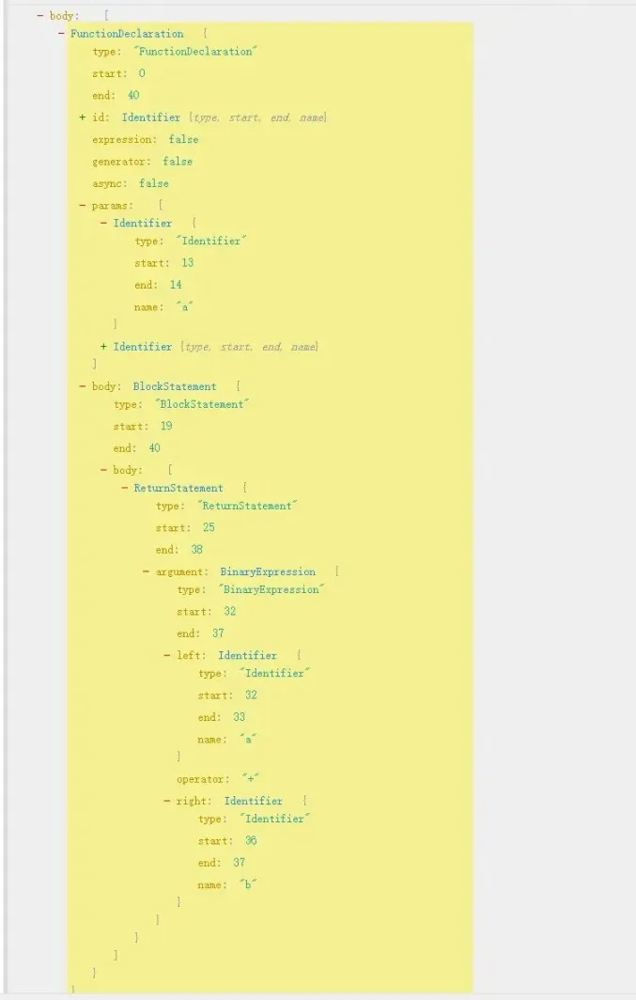

```
class Generator {
     visitFunctionDeclaration(node) {
        let str = 'function ';
        str += this.visitNode(node.id);
        str += '(';
        for (let paramIndex = 0; paramIndex < node.params.length; paramIndex++) {
            str += this.visitNode(node.params[paramIndex]);
            str += ((node.params[paramIndex] === undefined) ? '' : ',')
        }
        str = str.slice(0, str.length - 1);
        str += '){\n';
        str += this.visitNode(node.body);
        str += '}';
        return str + '\n';
    }
}
```

First get node.id, which is add. Then, process the arguments (params) of the function. Because there may be multiple params, we need to loop through and join them with commas. Finally, call the visitNode method to join the node.body function body.

**Implement the visitBlockStatement method**

BlockStatement refers to block statements, which is the part enclosed by braces. For example, the AST for the block statement in our add function is:

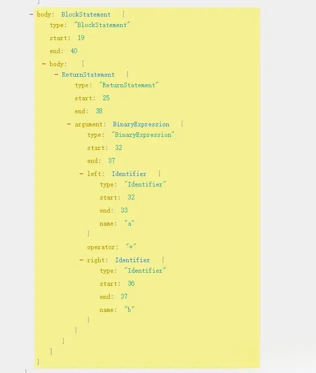

```
class Generator {
    visitBlockStatement(node) {
        let str = '';
        str += this.visitNodes(node.body);
        return str;
    }
}
```

We just need to use the visitNodes function to join its node.body.

**Implement the visitCallExpression method**

CallExpression refers to function calls, for example, add(firstNum, secondNum). Its important attributes are:

- callee: which is add

- arguments: which are the parameters firstNum and secondNum passed when calling.

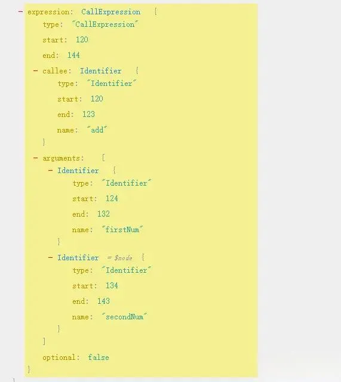

```
class Generator {
   visitCallExpression(node) {
        let str = '';
        str += this.visitIdentifier(node.callee);
        str += '(';
        for (const arg of node.arguments) {
            str += this.visitNode(arg) + ',';
        }
        str = str.slice(0, -1);
        str += ');';
        return str + '\n';
    }
}
```

We just need to join its callee and the arguments in parentheses ().

**Implement the visitReturnStatement method**

ReturnStatement refers to return statements, like return a + b. Its AST is:

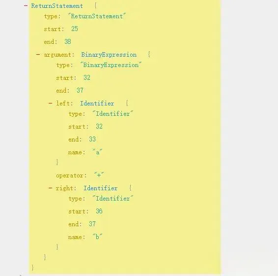

It’s also relatively simple to implement, just joining node.argument directly:

```
class Generator {
   visitReturnStatement(node) {
        let str = '';
        str = str + '  return ' + this.visitNode(node.argument);
        return str + '\n';
    }
}
```

**Implement the visitExpressionStatement method**

ExpressionStatement refers to expression statements, that have return values when executed, such as add(firstNum, secondNum);. This is wrapped around CallExpression with an ExpressionStatement, and returns the result of the function call after execution. The AST is as followed:

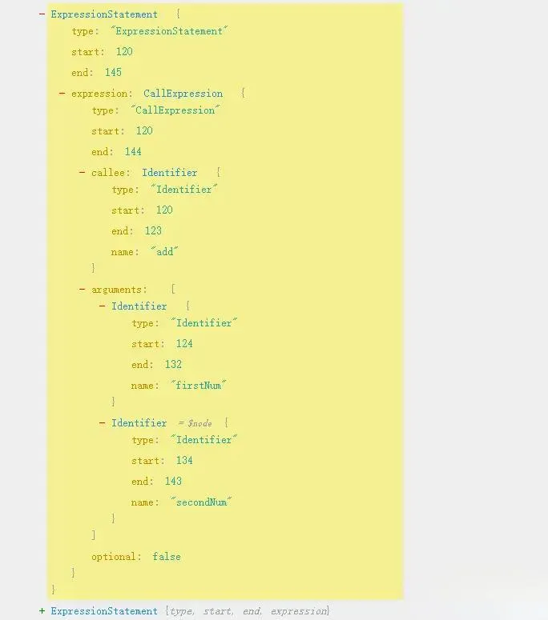

So the implementation is simple, we just need to process and return its expression.

```
class Generator {
    return this.visitNode(node.expression);
}
```

This way, we have fully implemented the Generator. Now we can start traversing the AST.

```
// tree-shaking.js
const acorn = require('acorn');
const fs = require('fs');
const path = require('path');
const buffer = fs.readFileSync(path.resolve(process.cwd(), './src/index.js')).toString();
const body = acorn.parse(buffer, {
    ecmaVersion: 'latest',
}).body;
// Reference a Generator class to generate corresponding code for AST
const Generator = require('./generator');
// Create a Generator instance
const gen = new Generator();
// Define a variable "decls" to store all function or variable type nodes (Map type)
const decls = new Map();
// Define a variable "calledDecls" to store used function or variable type nodes (Array type)
const calledDecls = [];
// Start traversing AST
body.forEach(node => {
    if (node.type === 'FunctionDeclaration') {
        const code = gen.run([node]);
        decls.set(gen.visitNode(node.id), code);
        return;
    }
    if (node.type === 'VariableDeclaration') {
        for (const decl of node.declarations) {
            decls.set(gen.visitNode(decl.id), gen.visitVariableDeclarator(decl, node.kind));
        }
        return;
    }
    if (node.type === 'ExpressionStatement') {
        if (node.expression.type === 'CallExpression') {
            const callNode = node.expression;
            calledDecls.push(gen.visitIdentifier(callNode.callee));
            for (const arg of callNode.arguments) {
                if (arg.type === 'Identifier') {
                    calledDecls.push(arg.name);
                }
            }
        }
    }
    if (node.type === 'Identifier') {
        calledDecls.push(node.name);
    }
})
console.log('decls', decls);
console.log('calledDecls', decls);`
```

Run it with node tree-shaking.js, the result is:

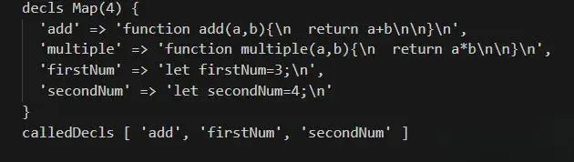

It’s obvious that we have four nodes, function or variable type nodes in decls, and only three have been called in calledDecls. Notably, the multiple function has not been called and can be tree-shaken. After getting this information, we can now start generating the code after tree-shaking.

### Step 3: Generate new code based on the information obtained in Step 2

```
...
code = calledDecls.map(c => decls.get(c)).join('');
console.log(code);
```

We directly traverse calledDecls to generate new source code, and the print result is as follows:

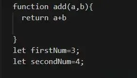
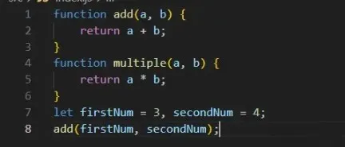

Hmm! When comparing it with our original file, although multiple has been removed, our function call statement add(firstNum, secondNum); is missing. Let's handle this situation simply.

We declare a code array:

```
// ...
const calledDecls = [];
// Save code information
const code = [];
// ...
```

We store the information that doesn't belong to `FunctionDeclaration` and `VariableDeclaration`:

```
// tree-shaking.js
body.forEach(node => {
    if (node.type === 'FunctionDeclaration') {
        const code = gen.run([node]);
        decls.set(gen.visitNode(node.id), code);
        return;
    }
    if (node.type === 'VariableDeclaration') {
        for (const decl of node.declarations) {
            decls.set(gen.visitNode(decl.id), gen.visitVariableDeclarator(decl, node.kind));
        }
        return;
    }
    if (node.type === 'ExpressionStatement') {
        if (node.expression.type === 'CallExpression') {
            const callNode = node.expression;
            calledDecls.push(gen.visitIdentifier(callNode.callee));
            for (const arg of callNode.arguments) {
                if (arg.type === 'Identifier') {
                    calledDecls.push(arg.name);
                }
            }
        }
    }
    if (node.type === 'Identifier') {
        calledDecls.push(node.name);
    }
    // Save code information
    code.push(gen.run([node]));
})
```

When printing the output, make sure to include the information from the code array:

```
// tree-shaking.js
code = calledDecls.map(c => decls.get(c)).concat(code).join('');
console.log(code);
```

Then, we run it and print the result:

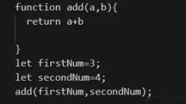

Now, we have completed a simple version of tree-shaking. Of course, webpack's tree-shaking capability is much stronger. We just wrote the simplest version, and real projects are much more complicated.

- Processes file dependencies (import/export)

- Handles scopes

- Recursive tree-shaking. As it’s possible that removing some code will produce new unused code, it needs to be handled recursively.

- And much more…
